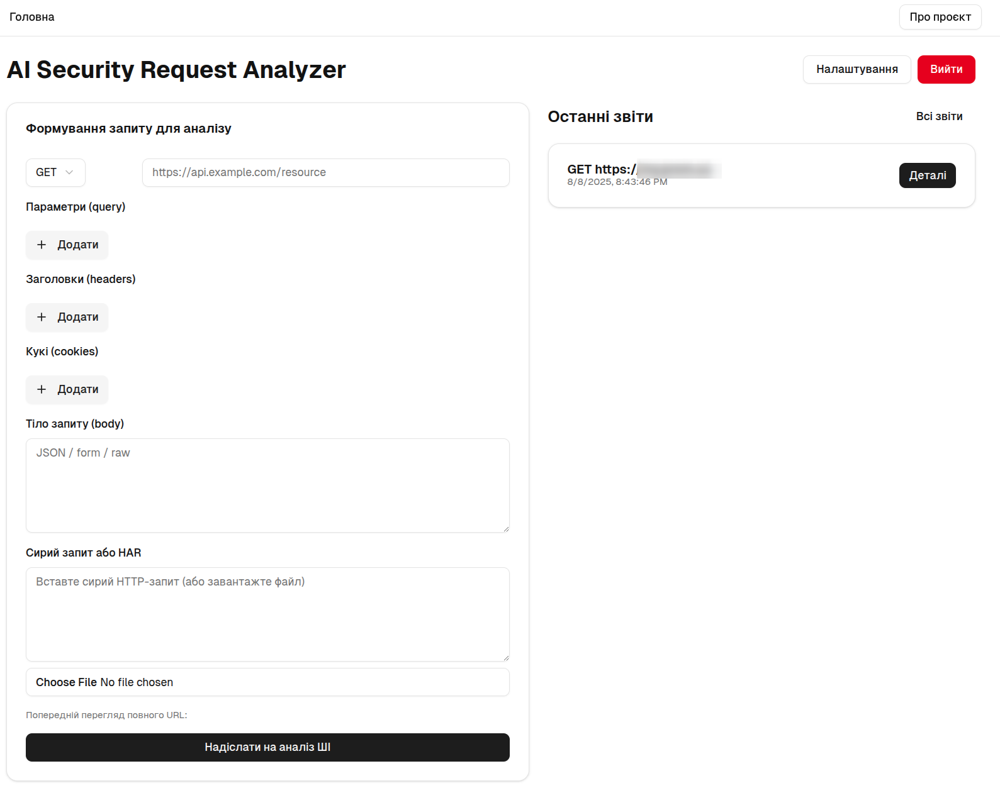
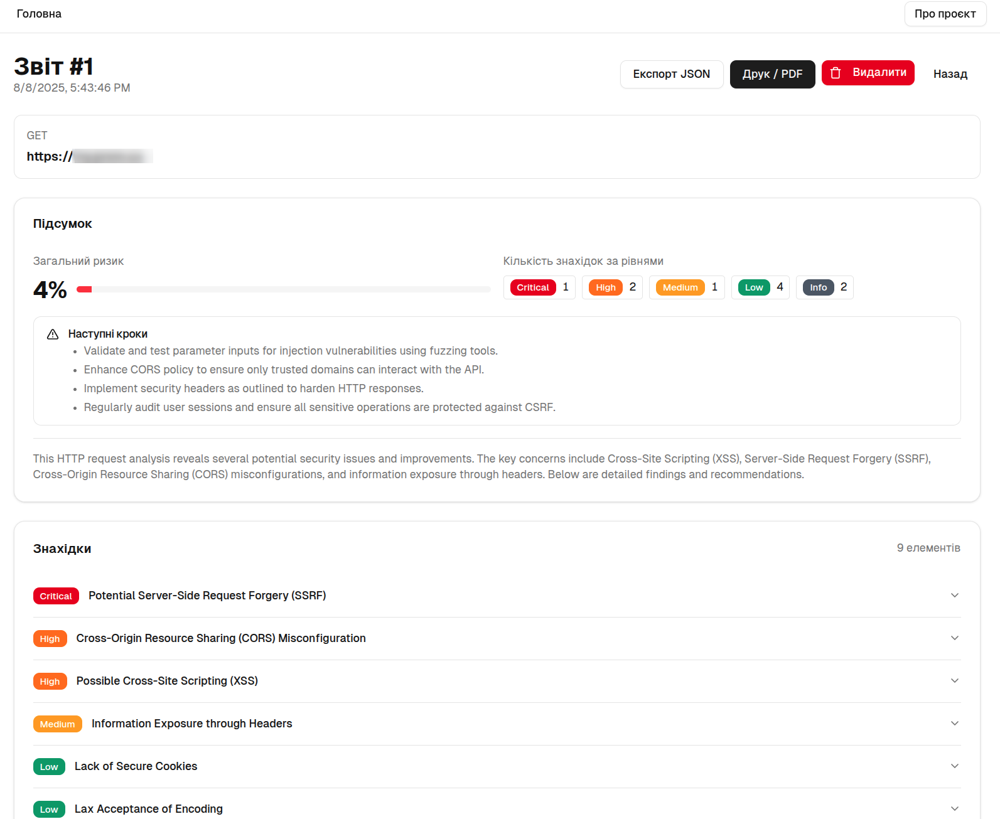
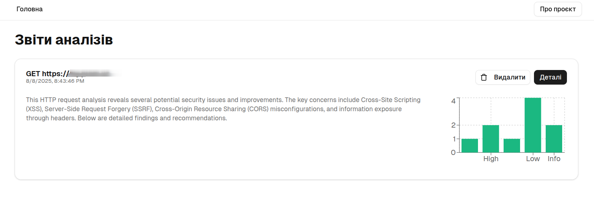
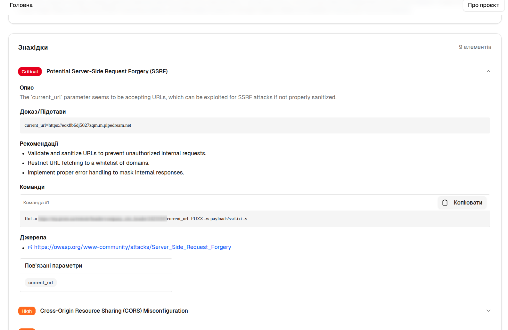

# AI Security Request Analyzer

Універсальний веб‑додаток для аналізу HTTP‑запитів за допомогою ШІ (xAI Grok‑3). Підтримує:
- Вхід/вихід з логіном/паролем (SQLite).
- Конструктор запитів (метод, URL, заголовки, параметри, кукі, тіло) або сирий HTTP/HAR.
- Виклик ШІ через AI SDK і отримання структурованого звіту з практичними рекомендаціями та командами.
- Перегляд списку звітів, графік за рівнями критичності, експорт JSON, друк.
- Налаштування API ключа та секрету сесій.
- Персистентність у `./data/app.db`.






## Швидкий старт (Docker)

1. Встановіть Docker і Docker Compose.
2. Запустіть:
```
   docker compose up --build
```
3. Відкрийте http://localhost:3080
4. Увійдіть:
   - Логін: `admin`
   - Пароль: `admin123!`
5. Перейдіть у Налаштування та збережіть `XAI_API_KEY`.
6. Використовуйте панель для аналізу запитів.

Default порт у контейнері 3000, прокинуто на 3080.

## Локальний старт без Docker

- Встановіть залежності та запустіть: `npm i && npm run dev`
- Відкрийте http://localhost:3000

Примітка: У середовищі v0 попередній перегляд працює без Docker.

## Безпека
- Паролі хешуються `bcryptjs`.
- Сесії підписані JWT (`jose`). Рекомендується встановити власний секрет у Налаштуваннях.
- База даних локальна SQLite (`./data/app.db`).

## Під капотом
- Next.js App Router, Server/Client Components та Server Actions [^1][^2].
- AI SDK (`ai`, `@ai-sdk/xai`) із моделлю `grok-3`. Не використовується edge runtime.
